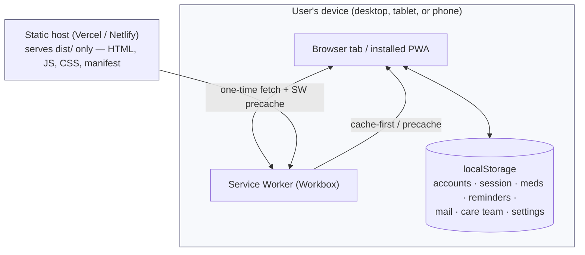
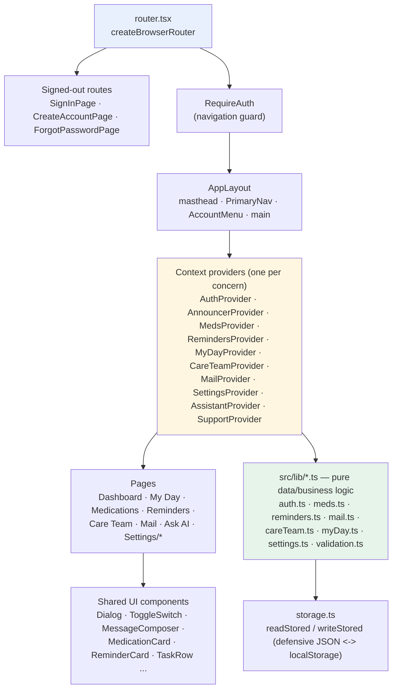

# CareConnect — Architecture & Technical Overview

Companion to [docs/testing-report.md](testing-report.md) and
[docs/accessibility-performance-summary.md](accessibility-performance-summary.md): this document
covers the system's shape, the reasoning behind its framework choices, the technical problems
that came up while building it, and how code is shared rather than duplicated.

---

## 1. High-level architecture diagram

CareConnect is a **single-page, offline-capable Progressive Web App with no backend**. There is no
server, database, or network call of any kind — every "backend" concern (accounts, sessions,
medications, reminders, mail, care team, settings) is simulated client-side and persisted to
`localStorage`.

### 1.1 System context

There is deliberately no application server in this diagram — the static host only ever serves the
built assets once; after the service worker installs, the app can run entirely offline.

### 1.2 Client application layers

Data flows one direction: **pages** call functions/state exposed by a **context provider**, the
provider delegates to a **lib module** for the actual business logic (validation, ID generation,
scheduling math), and the lib module persists through the shared `storage.ts` helpers. No
component talks to `localStorage` directly.

---

## 2. Framework choices and rationale

| Concern | Choice | Why |
| --- | --- | --- |
| Build tool | **Vite 8** | Native ESM dev server (near-instant HMR), first-class TypeScript/React support, and the plugin that generates the PWA service worker (`vite-plugin-pwa`) integrates directly into the same build. |
| UI library | **React 19** | Team familiarity, huge ecosystem for a coursework timeline, and its component model maps cleanly onto the app's many small, reusable interactive pieces (dialogs, cards, toggles) reused across pages. |
| Language | **TypeScript** | The entire data layer (medications, reminders, schedules, auth) is shape-sensitive; compile-time checking of `localStorage`-backed types catches a whole class of "the stored JSON doesn't match what the UI expects" bugs before runtime. |
| Routing | **React Router 7** (`createBrowserRouter`) | Real URLs (not hash routes) were a requirement so the app behaves like a normal website and can be deep-linked/installed as a PWA with a real `start_url`/`scope`; `createBrowserRouter` also enables route-level lazy loading (`React.lazy`) for code-splitting. |
| State management | **Plain Context API, one provider per concern** — no Redux/Zustand/etc. | The app has no cross-cutting global state beyond auth and announcements; each feature (meds, reminders, mail...) owns its own isolated provider, which keeps re-renders scoped and avoids the boilerplate of a global store for what is fundamentally a set of independent CRUD screens. |
| Styling | Plain CSS (`src/index.css`), mobile-first with `clamp()`/media queries | No CSS-in-JS runtime cost, works identically whether the app is loaded fresh or served from the service worker cache, and keeps the accessibility-critical color/contrast values in one auditable file (see the WCAG contrast fixes in [docs/testing-report.md](testing-report.md) Section 1.5). |
| Offline / installability | **`vite-plugin-pwa`** (Workbox, `generateSW`) | Gives the app a real manifest, install prompt, and offline navigation fallback with a small, declarative config instead of hand-rolling a service worker — directly matching the "offline-first PWA" project requirement. |
| Auth "backend" | Client-only, `localStorage` + **PBKDF2-SHA256** (210k iterations, per-account salt, constant-time compare) | There is no server in this project's scope, but the credential handling still demonstrates the right *shape* of real auth (salted, iterated hashing; no plaintext passwords at rest) rather than storing passwords as-is. |
| Unit testing | **Vitest + Testing Library** | Vite-native (shares config/transform with the app build, so tests run fast with zero extra bundler setup), and Testing Library's role/label-based queries keep tests aligned with what the accessibility work already cares about. |
| End-to-end / accessibility testing | **Playwright + axe-core** | The only combination that could drive real Chromium, Firefox, WebKit, *and* Edge engines from one test suite and run automated WCAG scans (`@axe-core/playwright`) against a real running app — required for the automated accessibility and cross-browser testing deliverables. |
| Linting | **oxlint** | Rust-based, near-instant on this codebase size, with a React plugin covering hooks rules — fast enough to run on every `npm run check` without slowing the workflow down. |

---

## 3. Key technical challenges and solutions

| Challenge | Solution |
| --- | --- |
| **No backend, but auth still needs to feel real.** Storing plaintext passwords in `localStorage` would be indefensible even for a prototype. | Implemented PBKDF2-SHA256 with 210,000 iterations and a per-account random salt in [src/lib/auth.ts](../src/lib/auth.ts), with constant-time comparison for both sign-in and recovery-code verification. Documented clearly in the README as a demo boundary, not production security. |
| **Real URLs (not hash routes) break on static hosts** that don't know to serve `index.html` for unknown paths (e.g. refreshing `/dashboard` directly). | Added `public/_redirects` (Netlify) and `vercel.json` (Vercel) rewrite rules, plus the service worker's `navigateFallback: '/index.html'` so the same fallback works once the app is installed offline. |
| **Duplicating navigation markup for mobile vs. desktop** would create two DOMs for screen readers to reconcile and double the maintenance surface. | [`PrimaryNav`](../src/components/PrimaryNav.tsx) reads a single `appNavItems` array and the `useIsWideLayout` hook, then renders either an inline row or a hamburger-triggered disclosure from that one source — screen readers only ever see one navigation landmark. |
| **Building an accessible modal/dropdown focus trap from scratch is easy to get subtly wrong** (escape handling, backdrop clicks, returning focus). | Built [`Dialog`](../src/components/Dialog.tsx) as a thin wrapper around the native `<dialog>` element and its `showModal()` API, which gives a real, browser-native focus trap, inert background, and Escape-to-close for free — reused by all five modals in the app instead of five hand-rolled implementations. |
| **Lazy-loaded routes caused false-positive accessibility test failures.** Automated axe scans occasionally ran against the `<Suspense>` fallback (`"Loading section..."`, no heading) before the real page mounted, flagging a missing `<h1>` that wasn't actually a real defect. | Test suite now waits for the route's real `<h1>` to become visible before scanning ([e2e/a11y.spec.ts](../e2e/a11y.spec.ts)) — a scanning-timing fix, not an app change. |
| **Cross-browser end-to-end runs were timing out** under high parallelism — four browser engines each spinning up fresh accounts, and PBKDF2's 210k iterations per sign-up is deliberately CPU-expensive. | Capped Playwright to `workers: 4` and raised the per-test timeout in [playwright.config.ts](../playwright.config.ts) rather than weakening the hashing, since the hashing cost is the whole point of that security decision. |
| **A genuine, but non-fixable, Safari/WebKit keyboard quirk**: Safari's default "Tab" behavior only cycles through form controls (not links), and clicking a `<button>` doesn't give it programmatic focus, unless the user enables "Full Keyboard Access". | Confirmed via manual research that this is a real Safari OS-level default, not an app bug; documented and explicitly asserted in both [e2e/cross-browser.spec.ts](../e2e/cross-browser.spec.ts) and [e2e/semantic-aria-focus.spec.ts](../e2e/semantic-aria-focus.spec.ts) rather than silently skipped, and written up in [docs/testing-report.md](testing-report.md) Section 3.1. |
| **Real WCAG AA color-contrast failures** existed in several avatar/badge/status-pill colors and one chat-bubble metadata style, invisible to the eye but caught by axe-core. | Recomputed relative-luminance contrast ratios by hand for each failing pair and replaced them with WCAG AA–compliant hex values in [src/index.css](../src/index.css) (full before/after list in [docs/testing-report.md](testing-report.md) Section 1.5), verified by re-running the automated scan. |
| **Offline/update UI needed to be announced correctly**, not just visually shown — a banner that isn't inside a landmark is invisible to screen-reader landmark navigation. | [`PwaStatus`](../src/components/PwaStatus.tsx) renders nothing when there's nothing to say, and wraps its offline/update/install banners in a single labelled `role="region"` so the content is always discoverable, never an orphaned node outside any landmark. |

---

## 4. Code reuse across platforms

CareConnect ships as **one codebase** that runs unmodified across device form factors (phone,
tablet, desktop) and, once installed, across OS platforms (Windows, macOS, Android, iOS) — there
are no platform-specific forks, native shells, or separate mobile/desktop builds.

### 4.1 Reuse across device sizes (responsive, not adaptive)

- **One set of components renders at every breakpoint.** Mobile-first CSS with `clamp()` and two
  media-query breakpoints (`768px`, `1440px`) reflows the same markup — there is no separate
  "mobile view" component tree.
- **Navigation has one source of truth.** `appNavItems` in [PrimaryNav.tsx](../src/components/PrimaryNav.tsx)
  is the single list consumed by both the desktop horizontal row and the mobile hamburger
  disclosure, so there's exactly one navigation implementation to test and maintain, not two.
- **Shared hooks power both layouts:** [`useMediaQuery`/`useIsWideLayout`](../src/hooks/useMediaQuery.ts)
  decide *what* to render, and [`useDismiss`](../src/hooks/useDismiss.ts) (Escape + click-outside)
  is reused identically by the mobile nav panel *and* the account menu dropdown, despite being
  otherwise unrelated pieces of UI.

### 4.2 Reuse across OS platforms (installable PWA)

- The same build output (`dist/`) is what a desktop browser tab loads, what Windows/macOS "Install
  app" turns into a standalone window, and what Android/iOS "Add to Home Screen" turns into a
  home-screen app — configured entirely through one manifest in [vite.config.ts](../vite.config.ts)
  (`display: 'standalone'`, icons, `start_url`/`scope`). No platform-specific code path exists for
  "installed" vs. "browser tab" beyond CSS media features already used for responsiveness.
- Workbox-generated caching rules (images `CacheFirst`, fonts `CacheFirst`, navigation fallback)
  apply identically regardless of which OS installed the app.

### 4.3 Reuse across features (shared internal architecture)

- **One dialog implementation, five features.** [`Dialog`](../src/components/Dialog.tsx) is reused,
  unmodified, by Add Medication, Add Reminder, Add Task, Invite Caregiver, and Compose Message —
  each feature only supplies its own form content, not its own modal/focus-trap/Escape logic.
- **One storage layer, every data domain.** [`storage.ts`](../src/lib/storage.ts)'s
  `readStored`/`writeStored` helpers back every persisted domain — accounts, sessions, medications,
  reminders, mail, care team, settings — so JSON parsing/serialization and failure handling
  (corrupt data, full/disabled storage) are implemented once, not per-feature.
- **One provider shape, one concern each.** Every feature (`MedsProvider`, `RemindersProvider`,
  `MyDayProvider`, `CareTeamProvider`, `MailProvider`, `SettingsProvider`, ...) follows the same
  "Context + hook" pattern established by `AuthProvider`, so a contributor who understands one
  provider understands all of them.
- **One test fixture, every e2e suite.** [`signUpAndSignIn`](../e2e/fixtures.ts) and the shared
  route lists (`AUTHENTICATED_ROUTES`, `PUBLIC_ROUTES`) are reused across
  [e2e/a11y.spec.ts](../e2e/a11y.spec.ts), [e2e/cross-browser.spec.ts](../e2e/cross-browser.spec.ts),
  and [e2e/semantic-aria-focus.spec.ts](../e2e/semantic-aria-focus.spec.ts) — three otherwise
  independent test suites share one authentication/navigation setup instead of three copies of it.
